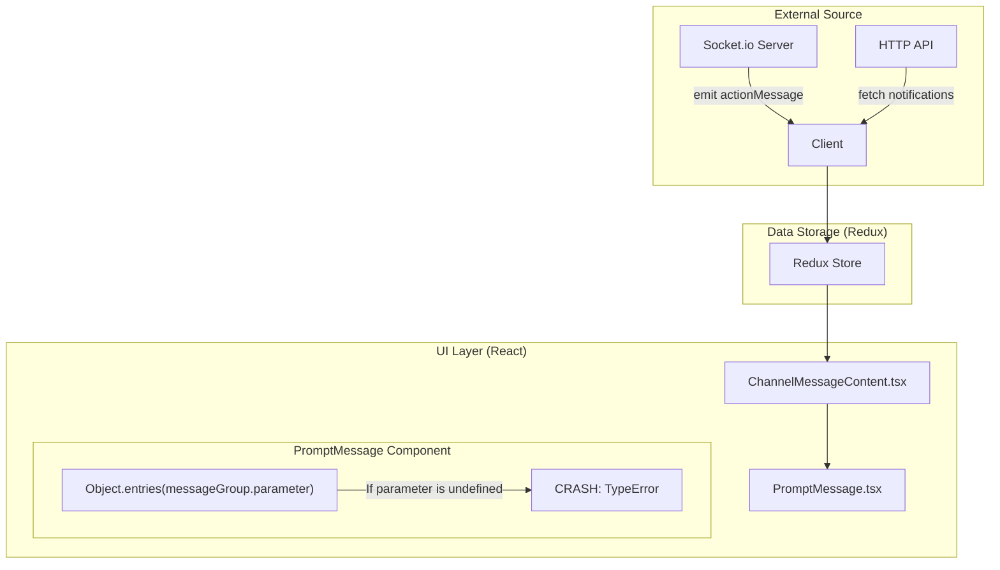
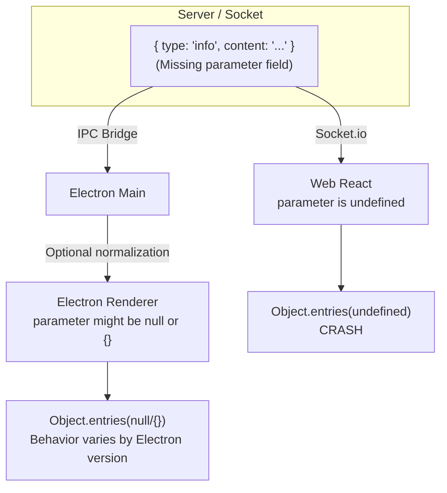
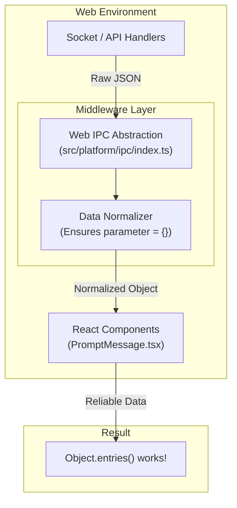

# Bug Investigation Report: UI Layer Object.entries Crash

**Date:** 2026-01-31  
**Subject:** Investigation of `TypeError` in `PromptMessage.tsx` during UI rendering.

## 1. Problem Description
After fixing the data layer (toQuery), a similar crash occurred in `src/components/PromptMessage.tsx`. This happens when the application tries to render a "System Message" (Prompt) that does not contain any dynamic parameters.

## 2. Root Cause Analysis

The error occurs because the UI component assumes that every `PromptMessage` object will have a defined `parameter` object.

### Architectural Flow & Crash Point

### Technical Detail:
- **Location:** `src/components/PromptMessage.tsx` line 23.
- **Cause:** Some system messages are static (e.g., a simple "Connection Lost" notification) and do not include a `parameter` field.
- **JavaScript Behavior:** `Object.entries(undefined)` throws a fatal error, unmounting the entire message list component.

## 3. Web vs Electron Behavior Comparison

Even though both platforms run the same React component, the error is more frequent or only present on the Web due to how data is serialized and delivered.

### Data Flow Comparison Diagram

### Why Electron might avoid the crash:
1.  **IPC Serialization:** When data passes through Electron's `ipcMain` to `ipcRenderer`, it undergoes JSON-like serialization. Some versions of Electron or custom IPC wrappers might normalize `undefined` to `null` or omit the key entirely, but the main reason is often that the **Main Process** (written in Node.js) acts as a data-cleaning layer.
2.  **Environment Strictness:** Standard browsers (Chrome/Firefox) are often stricter with `Uncaught TypeError` in the UI thread compared to the Electron renderer's environment during certain development modes.

## 4. The "Electron-Like" Solution: IPC Normalization Middleware

Instead of adding guards in every React component, we can mimic Electron's Main Process behavior by adding a **Normalization Middleware** in the Web IPC layer.

### Architecture with IPC Interceptor

### Why this is better:
- **Contract Fulfillment:** The TypeScript type says `parameter` is required. The middleware ensures this contract is fulfilled at runtime, mirroring how Electron's Main process typically prepares data.
- **Global Fix:** This fixes the crash for ALL components receiving these messages, not just one.
- **Maintainability:** UI components stay clean and focused on rendering, not data sanitization.

## 5. New Findings: content.split() Crash

A secondary crash was identified at `content.split(' ')`. This occurs when the `content` field is missing from the message object.

### Updated Implementation Plan
1.  **Modify `src/platform/ipc/index.ts`**: 
    - Ensure `parameter = {}`
    - Ensure `contentMetadata = {}`
    - **Ensure `content = ""`** (New)
2.  **UI Component updates**: Add defensive checks during rendering.

## 6. Implementation Strategy
... (rest of the report)
