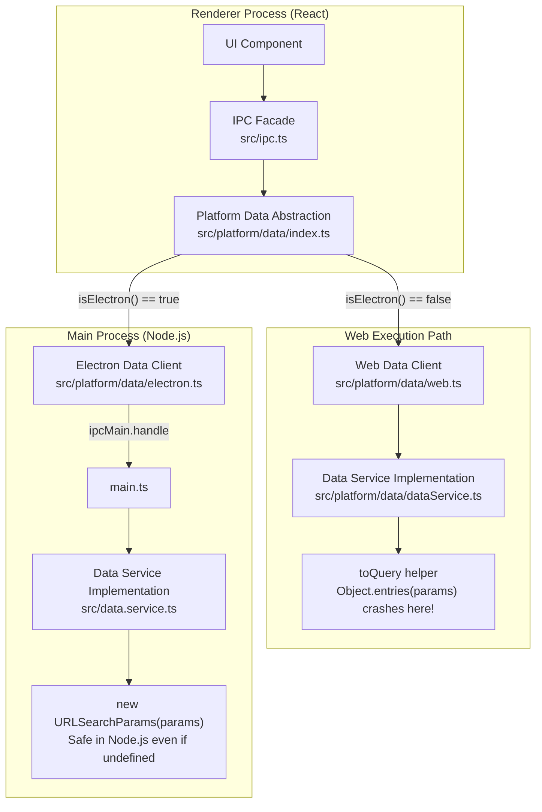

# Bug Investigation Report: Web-only Object.entries Crash

**Date:** 2026-01-31  
**Subject:** Investigation of `Uncaught TypeError: Cannot convert undefined or null to object` in Web mode.

## 1. Problem Description
Users encountered a crash in the Web version of RiceCall that does not occur in the Electron version. The stack trace points to `Object.entries` being called on an `undefined` or `null` value during data fetching.

## 2. Root Cause Analysis

The investigation revealed that while Web and Electron share the same `ipc.data` interface, they diverge in their implementation of parameter serialization for HTTP requests.

### Architectural Flow Diagram



### Why the behavior differs:

1.  **Web Path (Crashing):**
    *   Location: `src/platform/data/dataService.ts`
    *   Mechanism: Uses a custom `toQuery(params)` helper.
    *   Fault: This helper calls `Object.entries(params)` directly. If a data method is called without arguments (e.g., `ipc.data.servers()`), `params` is `undefined`, leading to the `TypeError`.

2.  **Electron Path (Safe):**
    *   Location: `src/data.service.ts` (Main Process)
    *   Mechanism: Directly uses `new URLSearchParams(params).toString()`.
    *   Reason: In Node.js, `new URLSearchParams(undefined)` is a valid constructor call that returns an empty object, resulting in an empty string. The built-in容錯 (tolerance) of the native class prevents the crash.

## 3. Findings in Codebase

The problematic `toQuery` implementation exists in two locations:
- `src/platform/data/dataService.ts`
- `src/handlers/data.handler.ts`

## 4. Proposed Fix

Modify the `toQuery` function in both files to include a null/undefined guard:

```typescript
function toQuery(params: Record<string, unknown> | undefined | null): string {
  if (!params) return ''; // Guard clause
  const filtered: Record<string, string> = {};
  for (const [k, v] of Object.entries(params)) {
    if (v !== undefined && v !== null) {
      filtered[k] = String(v);
    }
  }
  return new URLSearchParams(filtered).toString();
}
```
