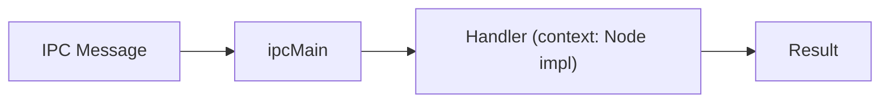
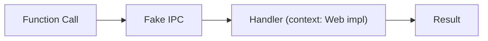

# 處理器模式 (Handler Pattern)

## 1. 問題背景
在舊版 Electron 應用中，業務邏輯通常直接寫在 `ipcMain.on(...)` 回呼函式內。
這造成兩個問題：
1.  **測試困難**：必須啟動整個 Electron 環境才能測試邏輯。
2.  **無法重用**：Web 版無法使用這些邏輯，因為 Web 沒有 `ipcMain`。

## 2. 解決方案：Handler Pattern
我們將業務邏輯抽離成純粹的 Async Functions，稱為 **Handlers**。

### 定義
一個 Handler 是一個接受參數並回傳結果的函式，它**不依賴**任何全域狀態（盡可能），而是透過 **Context** 取得依賴。

```typescript
type IpcHandler = (...args: any[]) => Promise<any>;
```

### 依賴注入 (Dependency Injection) - `HandlerContext`
為了讓同一份邏輯能在 Node.js (Electron) 和 Browser (Web) 執行，我們注入了一個 `context` 物件：

```typescript
export interface HandlerContext {
  storage: IpcStorage;      // 抽象化的儲存 (Electron-Store vs LocalStorage)
  api: ApiClient;           // 抽象化的網路 (Axios vs Fetch)
  broadcast: Broadcaster;   // 抽象化的通知 (Window.send vs BroadcastChannel)
}
```

## 3. 資料流方塊圖

### Electron 環境


### Web 環境


## 4. 實作範例

**定義 Handler (`src/handlers/auth.handler.ts`):**
```typescript
export const loginHandler = async (data: LoginData, context: HandlerContext) => {
  // 1. 使用 context.api 發送請求
  const result = await context.api.post('/login', data);
  
  // 2. 使用 context.storage 存 Token
  if (result.token) {
    context.storage.set('token', result.token);
  }
  
  return result;
};
```

**註冊 Handler (`src/handlers/index.ts`):**
```typescript
export function createAuthHandlers() {
  return {
    async: {
      'auth-login': loginHandler
    }
  };
}
```
