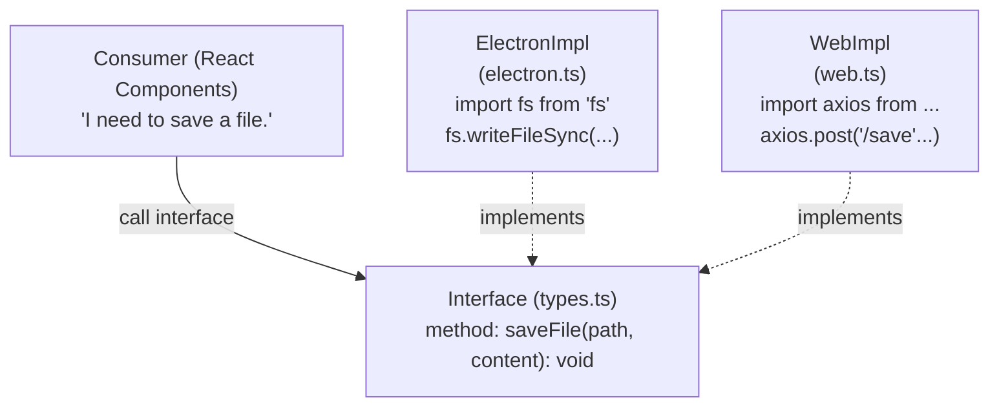

# 平台抽象層 (Platform Abstraction Layer)

## 1. 問題背景
在舊版架構中，前端程式碼直接呼叫 `window.require('electron')`。這導致程式碼無法在一般瀏覽器中執行，因為瀏覽器不存在 Electron API (如 `ipcRenderer`, `fs`, `shell`)。

## 2. 設計模式：策略模式 + 抽象工廠
我們採用了經典的策略模式 (Strategy Pattern)，將「做什麼 (Interface)」與「怎麼做 (Implementation)」分離。

### 檔案結構範例 (`src/platform/ipc/`)
每個功能模組都包含四個標準檔案：

| 檔案 | 角色 | 職責 |
|------|------|------|
| `types.ts` | **契約 (Contract)** | 定義介面 (Interface) 與型別。不包含任何實作邏輯。 |
| `electron.ts` | **策略 A** | 實作介面，使用 Electron 原生 API。 |
| `web.ts` | **策略 B** | 實作介面，使用 Web 標準 API (Fetch, LocalStorage) 或 Mock。 |
| `index.ts` | **工廠 (Factory)** | 根據 `isElectron()` 決定回傳策略 A 或 B 的單例。 |

## 3. 方塊圖解析



## 4. 關鍵實作細節


### 單例模式 (Singleton)
工廠方法 (如 `getIpcRenderer()`) 會快取實體，確保整個應用程式生命週期中只建立一次 Adapter。

```typescript
let instance: IpcRenderer | null = null;
export function getIpcRenderer() {
  if (instance) return instance;
  instance = isElectron() ? new ElectronIpcRenderer() : initWebIpc();
  return instance;
}
```
