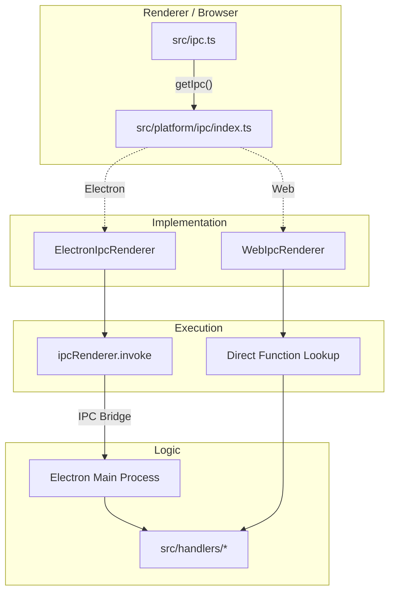

# IPC 通訊層 (IPC Layer)

IPC (Inter-Process Communication) 是 Electron 應用的神經系統。在 RiceCall 重構中，我們保留了 IPC 的語意，但在 Web 端替換了其底層實作。

## 1. 架構圖



## 2. Web 端模擬 IPC (Fake IPC)

Web 端的 `WebIpcRenderer` 並不真的發送訊息，它是個「本地轉發器」。

### 運作原理
1.  **初始化**: `src/platform/ipc/index.ts` 呼叫 `createAllHandlers()` 收集所有業務邏輯映射表 (Map)。
2.  **呼叫**: 當 UI 呼叫 `ipc.invoke('channel', args)`。
3.  **查找**: `WebIpcRenderer` 在映射表中查找對應 `channel` 的 Handler 函式。
4.  **執行**: 直接執行該 Handler，並注入 Web 版的 Context (LocalStorage, Fetch API)。
5.  **回傳**: 將 Handler 的回傳值包裝成 Promise 回傳給 UI。

## 3. 廣播機制 (Broadcast)

IPC 的另一個功能是 `on` (監聽事件)。
- **Electron**: 使用 `BrowserWindow.webContents.send()`。
- **Web**: 使用 `BroadcastChannel` API。這允許不同 Tab 之間（例如主視窗與新開的 Popup Tab）能同步狀態。

```typescript
// src/platform/ipc/web.ts (簡化)
const bc = new BroadcastChannel('ricecall-ipc');

// 發送
broadcast: (channel, ...args) => {
  bc.postMessage({ channel, args });
}

// 接收
bc.onmessage = (ev) => {
  const listeners = registry.get(ev.data.channel);
  listeners.forEach(cb => cb(...ev.data.args));
}
```
