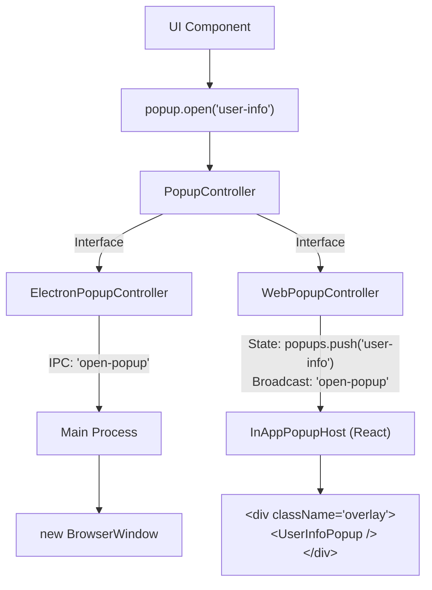

# 彈窗系統 (Popup System)

RiceCall 大量依賴多視窗 (Multi-window) 體驗。將此體驗移植到 Web 是最大的挑戰之一，因為瀏覽器對彈出視窗有嚴格限制。

## 1. 雙模式策略

我們採取了「原生視窗 (Electron)」與「DOM 浮層 (Web)」並行的策略，並透過統一介面隱藏差異。

| 特性 | Electron | Web |
|------|----------|-----|
| **實作基礎** | `BrowserWindow` | React Portal / Modal Overlay |
| **隔離性** | 高 (獨立 V8 Context) | 低 (同 Context) |
| **通訊** | IPC | React Props / Event Bus |
| **導航** | 載入 HTML 檔案 | 路由 (Router) 或 狀態切換 |

## 2. 元件互動圖



## 3. Web 實作細節：`InAppPopupHost`

在 Web 版中，我們在 `src/app/layout.tsx` 或根組件掛載了 `InAppPopupHost`。

這是一個全域的監聽器：
1.  它訂閱 `BroadcastChannel` 的 `'open-popup'` 事件。
2.  當收到開啟請求時，它會動態載入對應的 React Component (透過 `popupComponents.generated.tsx`)。
3.  它將元件渲染在畫面最上層 (Z-Index top)。

### Popup Config
為了管理這些動態元件，我們新增了 `src/popup.config.ts`：
```typescript
export const POPUP_CONFIGS = {
  'UserInfo': {
    component: lazy(() => import('@/popups/UserInfo')),
    width: 400,
    height: 600
  },
  // ...
};
```

## 4. `initialData` 的傳遞

- **Electron**: 透過 `window.location.search` (URL Query) 或 IPC 同步請求傳遞初始資料。
- **Web**: 使用 `sessionStorage` 暫存資料，Key 為 `ricecall:popup:initialData:${id}`。Popup 開啟時從中讀取。
