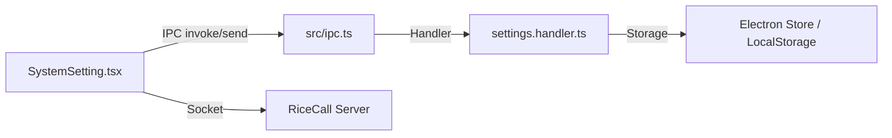

# 設定系統 (Settings System)

RiceCall 的設定系統負責管理應用程式的全域設定與使用者偏好。它分為兩個主要部分：**系統設定 (System Settings)** 與 **使用者設定 (User Settings)**。

## 1. 概述

設定系統旨在提供一致的介面來讀取與修改應用程式行為。
- **系統設定 (`SystemSettings`)**：儲存在本地端 (LocalStorage 或 Electron Store)，特定於當前裝置或應用程式實例 (例如：自動登入、音訊輸入/輸出裝置、熱鍵)。
- **使用者設定 (`UserSetting`)**：儲存在伺服器端，跟隨使用者帳號 (例如：隱私設定、訊息歷史紀錄偏好)。

## 2. 架構

設定系統採用典型的 IPC 架構，確保 Electron 與 Web 環境的相容性。

### 資料流
1.  **讀取**: 應用程式啟動時，Handler 從本地儲存讀取 `SystemSettings`。`UserSetting` 則在登入後由伺服器同步。
2.  **修改**:
    -   **系統設定**: UI 觸發 IPC 請求 -> Handler 更新本地儲存 -> 廣播變更事件 (IPC Broadcast)。
    -   **使用者設定**: UI 觸發 Socket 請求 (`editUserSetting`) -> 伺服器更新資料庫 -> 伺服器廣播更新給所有連線的客戶端。

## 3. 核心組件

### 3.1 Handler (`src/handlers/settings.handler.ts`)
負責處理系統設定的讀寫邏輯。它定義了預設值 (`DEFAULTS`) 並為每個設定鍵值 (Key) 自動產生對應的 `get` 和 `set` IPC 處理器。

**主要功能**:
-   **預設值管理**: 定義 `DEFAULTS` 物件。
-   **自動處理器生成**: 透過 `createSettingsHandlers` 遍歷設定鍵值，自動註冊 IPC 監聽器。
    -   `get-<key>`: 取得設定值。
    -   `set-<key>`: 設定值並廣播變更。
-   **同步**: 提供 `get-system-settings` 以一次取得所有設定。

### 3.2 UI (`src/popups/SystemSetting.tsx`)
設定視窗的 React 組件。它負責展示設定選項、處理使用者互動，並呼叫 IPC 或 Socket API 進行存取。

**主要分頁**:
-   **一般 (Basic)**: 自動登入、啟動、視窗行為、字體。
-   **音訊 (Audio)**: 輸入/輸出裝置選擇、錄音設定、回音/降噪。
-   **語音 (Voice)**: 發話模式 (按鍵/感應)、發話熱鍵。
-   **隱私 (Privacy)**: 阻擋名單、伺服器分享設定 (屬於 `UserSetting`)。
-   **熱鍵 (Hot Key)**: 自定義全域熱鍵。
-   **音效 (Sound Effect)**: 自定義各類事件的提示音。
-   **更新 (Update)**: 檢查更新、切換更新頻道。

## 4. 資料模型

### SystemSettings (本地)
定義於 `src/types.ts` (推測) 與 `settings.handler.ts` 的 `DEFAULTS` 中。
包含但不限於：
-   `autoLogin` (boolean)
-   `inputAudioDevice` / `outputAudioDevice` (string: deviceId)
-   `hotKey...` (string: key combination)
-   `font`, `fontSize`

### UserSetting (遠端)
主要由 `SystemSetting.tsx` 中的 `userSettings` 狀態管理。
包含但不限於：
-   `forbidFriendApplications`
-   `shareCurrentServer`
-   `notSaveMessageHistory`

## 5. 如何新增一個系統設定

1.  **更新型別定義**: 在 `src/types.ts` (或其他型別定義檔) 的 `SystemSettings` 介面中新增欄位。
2.  **設定預設值**: 在 `src/handlers/settings.handler.ts` 的 `DEFAULTS` 物件中新增該欄位與預設值。
3.  **註冊處理器**: 在 `src/handlers/settings.handler.ts` 的 `settingKeys` 陣列中加入該欄位名稱。Handler 會自動產生對應的 IPC 通道。
4.  **實作 UI**: 在 `src/popups/SystemSetting.tsx` 中新增對應的輸入元件 (Input/Checkbox/Select)，並透過 IPC 呼叫 `ipc.systemSettings.set` (或透過 `ObjDiff` 批次更新)。
