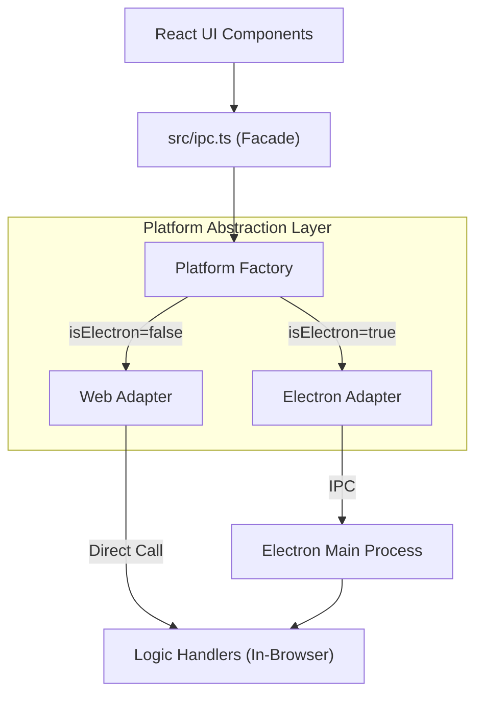

# RiceCall 架構知識庫 (Architecture Knowledge Base)

> **💡 閱讀建議**
> 本文件包含 Mermaid 圖表。建議使用 **VS Code** 開啟，並搭配內建的 Markdown 預覽器。
> 為了正確顯示圖表，請務必安裝：[Markdown Mermaid](https://marketplace.visualstudio.com/items?itemName=bierner.markdown-mermaid) 擴充功能。

歡迎來到 RiceCall 架構文件。本知識庫旨在詳細說明專案如何從單體 Electron 架構轉型為支援 Web/Electron 雙平台的同構 (Isomorphic) 架構。

文件採用**漸進式披露 (Progressive Disclosure)** 的方式組織，建議依序閱讀。

## 目錄導覽

### 1. [核心概念 (01-concepts)](./01-concepts/README.md)
了解支撐新架構的基礎設計模式與哲學。
- **[平台抽象層 (Platform Abstraction)](./01-concepts/platform-abstraction.md)**: 如何隔離 Web 與 Electron 的差異。
- **[處理器模式 (Handler Pattern)](./01-concepts/handler-pattern.md)**: 業務邏輯如何與 IPC 解耦。

### 2. [子系統詳解 (02-subsystems)](./02-subsystems/README.md)
深入各個模組的實作細節與資料流。
- **[IPC 通訊層](./02-subsystems/ipc-layer.md)**: 模擬 IPC 與真實 IPC 的切換機制。
- **[彈窗系統 (Popup System)](./02-subsystems/popup-system.md)**: 如何統一原生視窗與 Web Overlay。
- **[資料與認證](./02-subsystems/data-auth.md)**: 雙平台的資料存取策略。

### 3. [開發指南 (03-guides)](./03-guides/README.md)
實務操作手冊。
- **[如何新增功能](./03-guides/how-to-add-feature.md)**: End-to-End 的開發流程檢核表。

---

## 架構總覽 (High-Level Overview)

RiceCall 的新架構核心在於讓 UI 層 (Renderer) 對「當前運行環境」無感知。我們透過一層薄薄的介面 (Interface) 來達成此目的。

